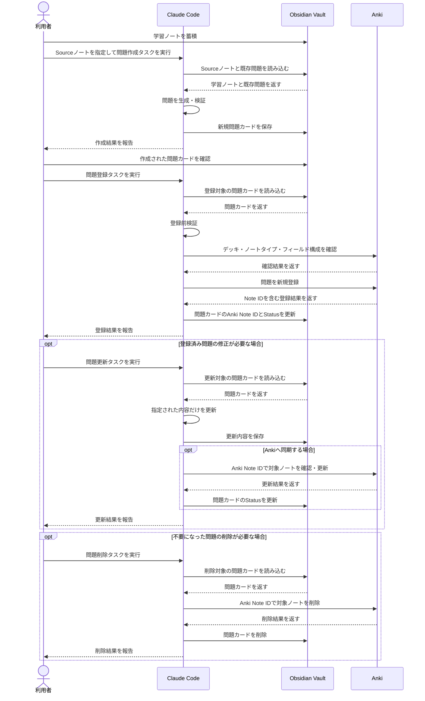
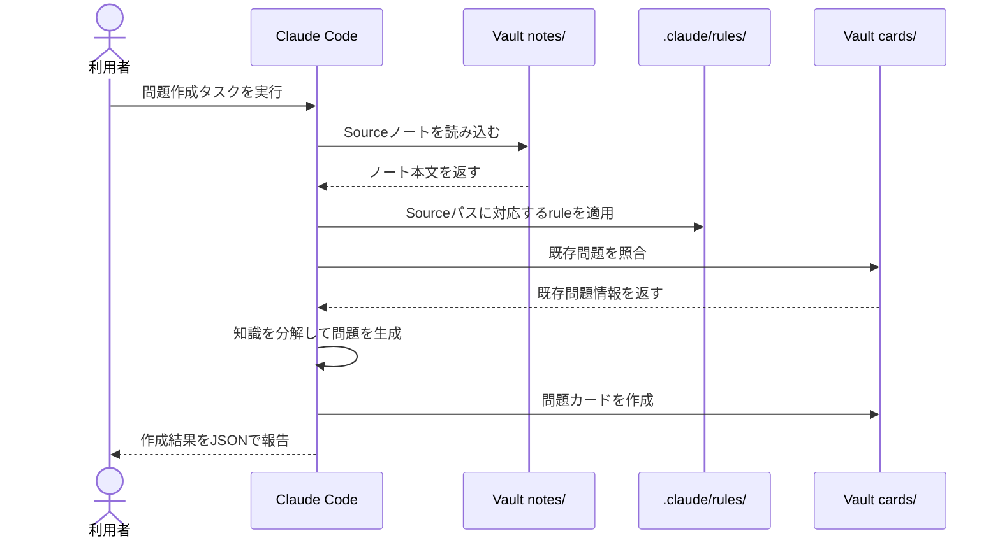
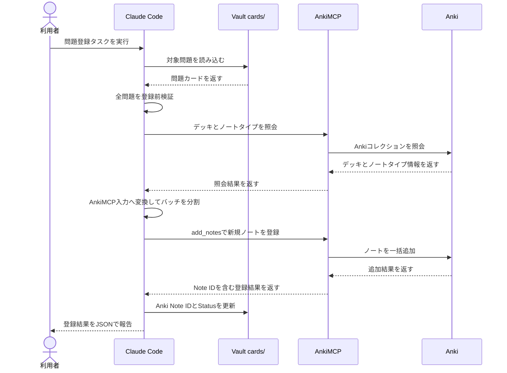
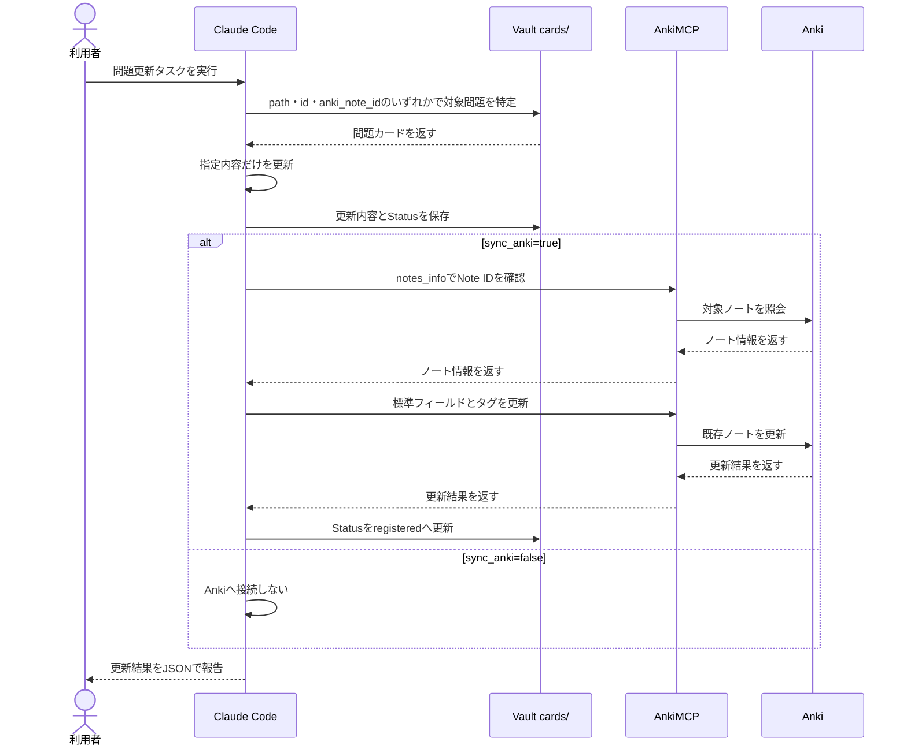
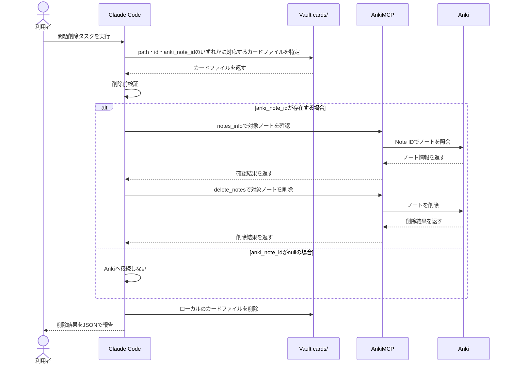

# Obsidian・Claude Code・AnkiMCP 暗記カード作成処理仕様書

## 目次

- [1. 本書の目的](#1-本書の目的)
- [2. システム概要](#2-システム概要)
  - [2.1 処理の目的](#21-処理の目的)
  - [2.2 処理の全体像](#22-処理の全体像)
- [3. システム要件](#3-システム要件)
  - [3.1 システム構成](#31-システム構成)
    - [3.1.1 Obsidian](#311-obsidian)
    - [3.1.2 Claude Code](#312-claude-code)
    - [3.1.3 Anki](#313-anki)
    - [3.1.4 AnkiMCP](#314-ankimcp)
  - [3.2 データ管理](#32-データ管理)
    - [3.2.1 学習ノートと問題カード](#321-学習ノートと問題カード)
    - [3.2.2 ノートの分類](#322-ノートの分類)
    - [3.2.3 Ankiへの保存情報](#323-ankiへの保存情報)
  - [3.3 処理設計](#33-処理設計)
    - [3.3.1 タスクの種類](#331-タスクの種類)
    - [3.3.2 既存問題の保護](#333-既存問題の保護)
  - [3.4 実行条件](#34-実行条件)
- [4. ディレクトリ構成](#4-ディレクトリ構成)
  - [4.1 構成方針](#41-構成方針)
  - [4.2 ディレクトリ構成図](#42-ディレクトリ構成図)
  - [4.3 各ディレクトリの役割](#43-各ディレクトリの役割)
- [5. カードデータ仕様](#5-カードデータ仕様)
  - [5.1 ローカルカード原本](#51-ローカルカード原本)
  - [5.2 Basicのデータ形式](#52-basicのデータ形式)
  - [5.3 Clozeのデータ形式](#53-clozeのデータ形式)
  - [5.4 ノートタイプの選択基準](#54-ノートタイプの選択基準)
  - [5.5 問題文と解答](#55-問題文と解答)
  - [5.6 タグ](#56-タグ)
  - [5.7 Source](#57-source)
  - [5.8 ID・Anki Note ID・状態](#58-idanki-note-id状態)
  - [5.9 数式](#59-数式)
- [6. 問題品質ルール](#6-問題品質ルール)
  - [6.1 一問一答](#61-一問一答)
  - [6.2 解答の一意性](#62-解答の一意性)
  - [6.3 重複の抑止](#63-重複の抑止)
  - [6.4 Clozeの制約](#64-clozeの制約)
  - [6.5 文字数の目安](#65-文字数の目安)
- [7. ヘッドレス実行仕様](#7-ヘッドレス実行仕様)
  - [7.1 非対話モード](#71-非対話モード)
  - [7.2 共通フラグ](#72-共通フラグ)
  - [7.3 --output-format](#73---output-format)
  - [7.4 --system-prompt](#74---system-prompt)
  - [7.5 Tool制御](#75-tool制御)
  - [7.6 可変引数](#76-可変引数)
- [8. 問題作成タスク](#8-問題作成タスク)
  - [8.1 目的](#81-目的)
  - [8.2 入力](#82-入力)
  - [8.3 処理](#83-処理)
  - [8.4 複数問題の生成](#84-複数問題の生成)
  - [8.5 出力](#85-出力)
  - [8.6 禁止事項](#86-禁止事項)
  - [8.7 実行コマンド](#87-実行コマンド)
  - [8.8 処理シーケンス](#88-処理シーケンス)
- [9. 問題登録タスク](#9-問題登録タスク)
  - [9.1 目的](#91-目的)
  - [9.2 入力](#92-入力)
  - [9.3 処理](#93-処理)
  - [9.4 登録前検証](#94-登録前検証)
  - [9.5 AnkiMCP入力への変換とバッチ分割](#95-ankimcp入力への変換とバッチ分割)
  - [9.6 登録結果とNote IDの保存](#96-登録結果とnote-idの保存)
  - [9.7 出力](#97-出力)
  - [9.8 禁止事項](#98-禁止事項)
  - [9.9 実行コマンド](#99-実行コマンド)
  - [9.10 処理シーケンス](#910-処理シーケンス)
- [10. 問題更新タスク](#10-問題更新タスク)
  - [10.1 目的](#101-目的)
  - [10.2 入力](#102-入力)
  - [10.3 ローカルのみを更新する場合](#103-ローカルのみを更新する場合)
  - [10.4 Ankiにも同期する場合](#104-ankiにも同期する場合)
  - [10.5 処理](#105-処理)
  - [10.6 出力](#106-出力)
  - [10.7 禁止事項](#107-禁止事項)
  - [10.8 実行コマンド](#108-実行コマンド)
  - [10.9 処理シーケンス](#109-処理シーケンス)
- [11. 問題削除タスク](#11-問題削除タスク)
  - [11.1 目的](#111-目的)
  - [11.2 入力](#112-入力)
  - [11.3 処理](#113-処理)
  - [11.4 削除前検証](#114-削除前検証)
  - [11.5 Anki側の削除](#115-anki側の削除)
  - [11.6 ローカル側の削除](#116-ローカル側の削除)
  - [11.7 出力](#117-出力)
  - [11.8 禁止事項](#118-禁止事項)
  - [11.9 実行コマンド](#119-実行コマンド)
  - [11.10 処理シーケンス](#1110-処理シーケンス)
- [12. 設定ファイル（settings.json）](#12-設定ファイルsettingsjson)
  - [12.1 model](#121-model)
  - [12.2 effortLevel](#122-effortlevel)
  - [12.3 outputStyle](#123-outputstyle)
  - [12.4 alwaysThinkingEnabled](#124-alwaysthinkingenabled)
  - [12.5 enableAllProjectMcpServers](#125-enableallprojectmcpservers)
  - [12.6 enabledMcpjsonServers](#126-enabledmcpjsonservers)
- [13. ルールファイル（rules）](#13-ルールファイルrules)
  - [13.1 Rules](#131-rules)
  - [13.2 パス固有ルールの適用方法](#132-パス固有ルールの適用方法)
- [14. スキル（skills）](#14-スキルskills)
- [15. MCP構成](#15-mcp構成)
  - [15.1 プロジェクトスコープ設定](#151-プロジェクトスコープ設定)
  - [15.2 AnkiMCP](#152-ankimcp)
  - [15.3 AnkiMCPの主なTool](#153-ankimcpの主なtool)
- [16. 運用手順](#16-運用手順)
  - [16.1 学習ノートの蓄積](#161-学習ノートの蓄積)
  - [16.2 問題の作成](#162-問題の作成)
  - [16.3 作成結果の確認](#163-作成結果の確認)
  - [16.4 Ankiへの登録](#164-ankiへの登録)
  - [16.5 問題の更新](#165-問題の更新)
  - [16.6 問題の削除](#166-問題の削除)
- [17. エラー処理と再実行](#17-エラー処理と再実行)
  - [17.1 エラー処理の方針](#171-エラー処理の方針)
  - [17.2 ローカル処理のエラー](#172-ローカル処理のエラー)
  - [17.3 AnkiMCP接続に関するエラー](#173-ankimcp接続に関するエラー)
  - [17.4 Anki／AnkiMCPに起因するエラー](#174-ankiankimcpに起因するエラー)

---

## 1. 本書の目的

本書は、Obsidian Vaultに蓄積したMarkdown形式の学習ノートを情報源として、Claude Codeが暗記用の問題カードを作成し、AnkiMCP Server Addonを介してAnkiへ登録する一連の処理について、設計・データ形式・実行方法・安全条件・運用方法を定義するものである。

本処理は、新しい問題を追加する都度Claude Codeを非対話モードで実行する反復運用を前提とする。そのため、問題の品質だけでなく、既存問題の意図しない変更の防止、Ankiへの重複登録の抑止、処理失敗時の原因特定、再実行の安全性を重視する。

---

## 2. システム概要

### 2.1 処理の目的

本処理は、Obsidian Vaultに蓄積した学習ノートを、Ankiでの反復学習に利用できる問題カードへ継続的に変換することを目的とする。

具体的には、次を実現する。

- 学習ノートから高品質な問題を生成し、暗記カード作成の手間を削減する
- 生成した問題カードを `cards/` 配下の永続的なローカル原本として管理し、Anki側の学習実行状態と区別して扱う
- 問題カードとAnkiノートの対応関係（`anki_note_id`）および同期状態（`status`）を管理し、重複登録や内容の不整合を防ぐ
- 問題の作成・登録・更新・削除を責務ごとに分離したタスクとして実行し、既存問題の意図しない変更・削除を防止する

### 2.2 処理の全体像

本システムでは、学習ノートから問題を作成する処理と、作成済み問題をAnkiへ登録する処理を分離する。既存問題を修正する処理も通常の作成・登録とは分離し、明示的に問題更新タスクとして実行する。既存問題を削除する処理も同様に分離し、明示的に問題削除タスクとして実行する。

処理の基本的な流れは次のとおりである。

1. Obsidian Vaultの `notes/` 配下へ学習ノートを蓄積する
2. Sourceノートを指定して問題作成タスクを実行し、`cards/` 配下へ問題カードを保存する
3. 作成された問題カードを必要に応じて確認する
4. 問題登録タスクを実行し、問題カードをAnkiへ登録する
5. 登録成功後、Anki Note IDと登録状態を問題カードへ記録する
6. 登録済み問題の修正が必要な場合だけ問題更新タスクを実行し、必要に応じてAnkiへ変更内容を同期する
7. 不要になった問題を削除する場合だけ問題削除タスクを実行し、Vaultの問題カードとAnkiノートを両方削除する

システム全体の処理シーケンスを次に示す。



---

## 3. システム要件

### 3.1 システム構成

本システムは、Obsidian・Claude Code・Anki・AnkiMCPの4つの主要コンポーネントから構成する。

システム全体の役割分担は、次のとおりとする。

- Obsidian: 学習ノートと問題カードの保管
- Claude Code: 問題生成・検証・登録・更新の実行制御
- Anki: 暗記カードの保存・復習・学習スケジューリング
- AnkiMCP: AnkiへのMCP経由のアクセス

#### 3.1.1 Obsidian

Obsidianは、MarkdownファイルをVault単位で管理する知識管理アプリケーションである。本システムでは `obsidian-repository` をVaultとし、`notes/` に学習ノート、`cards/` に生成済み問題カードを保存する。

Vault内ではフォルダを階層化して管理する。学習ノートをVault直下へ集約する必要はなく、`notes/daily_life/` や `notes/books/` のように内容の性質に応じて分類する。

#### 3.1.2 Claude Code

Claude Codeは、本システムの各タスクを実行する処理主体である。

`.claude/CLAUDE.md`, `.claude/settings.json`, `.claude/rules/`, `.claude/skills/` に定義された指示および設定を参照し、Vault内のファイル操作と必要なMCP Toolの呼び出しを行う。

日常運用では `claude -p` による非対話モードで実行する。タスクごとに利用可能なToolを制限し、各タスクの責務を越えた操作を行わせない。

#### 3.1.3 Anki

Ankiは、暗記カードを用いた反復学習を行うためのフラッシュカードアプリケーションである。

本システムでは、Claude Codeによって作成された問題を最終的な学習対象として保持し、Ankiのスケジューリング機能に基づいて復習を行う。

Ankiには標準ノートタイプの `Basic` と `Cloze` を使用する。問題本文、解答およびタグをAnkiへ登録し、ローカルID・Source・登録状態等のシステム運用情報はObsidian Vault側で管理する。

#### 3.1.4 AnkiMCP

AnkiMCPには、AnkiWebアドオンコード `124672614` のAnki MCP Server Addonを使用する。

AnkiMCPは、Anki内でMCPサーバーを動作させ、Claude Codeからデッキ・ノートタイプ・ノート等の情報を参照・操作できるようにする連携コンポーネントである。

本システムでは、主に次の処理で使用する。

- 登録先デッキの確認
- ノートタイプとフィールド構成の確認
- 新規ノートの一括登録
- 登録結果とAnki Note IDの取得
- 既存ノートの確認
- 問題更新時の既存ノート更新
- タグの更新
- 問題削除時の既存ノート削除

既定では、Anki起動時に `http://127.0.0.1:3141/` でローカルHTTP MCPサーバーが開始される。

AnkiMCP自体は学習データを保持する主体ではなく、Claude CodeとAnkiの間で操作要求と結果を仲介する役割を担う。

### 3.2 データ管理

本システムでは、学習の情報源、生成した問題の原本、Anki上の学習データを役割ごとに分離して管理する。

Obsidian Vaultを問題作成および管理の基準とし、Ankiは復習と学習スケジューリングを行う実行環境として扱う。

#### 3.2.1 学習ノートと問題カード

`notes/` 配下のMarkdownファイルを、問題作成の情報源となる学習ノートとする。

`cards/` 配下のMarkdownファイルを、Claude Codeが生成した問題カードのローカル原本とする。

これにより、次の役割を明確に分離する。

- `notes/`: 学習した知識を保存する
- `cards/`: その知識から作成した問題を保存する
- Anki: 登録された問題を用いて復習する

問題カードには、Ankiへ登録する問題本文や解答だけでなく、Source・ローカルID・Anki Note ID・登録状態等の管理情報も保持する。

#### 3.2.2 ノートの分類

`notes/` と `cards/` では、フォルダ階層の目的を分ける。

`notes/` 直下のフォルダは、学習ノートの性質を表す分類として使用する。また、この分類をClaude CodeのRulesを切り替える単位として利用する。

例えば、次のように分類する。

- `notes/books/`: 書籍から得た知識
- `notes/daily_life/`: 日常生活から得た知識

`cards/` 以下のフォルダ階層は、学習する知識の分野を表す分類として使用する。この階層はAnkiの分野タグと対応させる。

例えば、次のディレクトリは、

```text
cards/it/web_application/frontend/
```

次のAnkiタグへ変換する。

```text
it::web_application::frontend
```

#### 3.2.3 Ankiへの保存情報

Ankiでは、標準ノートタイプの `Basic` と `Cloze` を使用する。

Basicでは、標準フィールドの次の2項目を使用する。

- `Front`
- `Back`

Clozeでは、標準フィールドの次の2項目を使用する。

- `Text`
- `Back Extra`

分野・難易度・優先度はAnkiのネイティブタグとして登録する。

ローカルID・Anki Note ID・登録状態・Sourceノート等の運用管理情報はVault側だけで保持し、Anki標準ノートタイプへ独自フィールドとして追加しない。

### 3.3 処理設計

本システムでは、Claude Codeが実行する処理を責務ごとに独立したタスクへ分割する。

本システムにおける「タスク」とは、暗記カード作成処理のうち、Claude Codeを非対話モードで1回起動して実施させる処理の単位を指す。

各タスクでは、入力・変更可能なデータ・利用可能なTool・禁止操作を個別に定義する。

#### 3.3.1 タスクの種類

本システムでは、次の4タスクを定義する。

1. 問題作成タスク: 指定されたSourceノートから新しい問題を生成し、`cards/` 配下へ問題カードとして保存するタスク
2. 問題登録タスク: 作成済み問題カードを検証し、その内容を変更せずAnkiへ新規登録するタスク
3. 問題更新タスク: 利用者が明示的に指定した既存問題だけを修正し、必要に応じてAnki側の既存ノートへ変更内容を同期するタスク
4. 問題削除タスク: 利用者が明示的に指定したローカルIDの問題について、Vault側のカードファイルとAnki側のノートを両方削除するタスク

#### 3.3.2 既存問題の保護

- 問題作成・問題登録・問題更新・問題削除の責務を分離し、既存問題が意図せず変更・削除されないようにする
- 問題作成タスクでは、新しい問題カードだけを作成する。既存問題カードの内容を変更または上書きしない。
- 問題登録タスクでは、新しいAnkiノートの登録だけを行う。問題本文・解答・タグ等の問題内容を変更せず、登録成功後に必要な管理情報だけを問題カードへ記録する。
- 既存問題を変更できるのは問題更新タスクだけとする。問題更新タスクについても、利用者が明示した対象と変更内容以外を修正しない。
- 既存問題を削除できるのは問題削除タスクだけとする。問題削除タスクについても、利用者が明示した対象以外を削除しない。

### 3.4 実行条件

各タスクを実行する前に、次の共通条件を満たしている必要がある。

- Claude Codeがインストールされ実行可能であること
- VaultルートをClaude Codeの作業ディレクトリとして実行できること
- `.claude/` 配下の設定・Rules・Skillsを参照できること

タスクごとの追加条件は、次のとおりとする。

| タスク | Anki | Obsidian | その他の条件 |
| --- | --- | --- | --- |
| 問題作成 | 起動不要 | 起動不要 | SourceノートをReadツールで読み込めること |
| 問題登録 | 起動必須 | 起動不要 | Anki MCP Server Addonが有効であり、`http://127.0.0.1:3141/` のAnkiMCPへ接続できること |
| 問題更新（Anki同期なし） | 起動不要 | 起動不要 | `path`・`id`・`anki_note_id` のいずれか1つで更新対象を一意に特定できること |
| 問題更新（Anki同期あり） | 起動必須 | 起動不要 | Anki MCP Server Addonが有効であり、AnkiMCPへ接続できること。更新対象の問題カードに `anki_note_id` が保存されていること |
| 問題削除 | 起動必須 | 起動不要 | Anki MCP Server Addonが有効であり、AnkiMCPへ接続できること。`path`・`id`・`anki_note_id` のいずれか1つで削除対象を一意に特定できること |

Obsidianデスクトップアプリは、本システムの各タスクを実行するための必須条件ではない。Claude CodeはVaultルートを作業ディレクトリとし、Vault内のファイルを直接読み書きする。

一方、AnkiMCP Server AddonはAnki内で動作するため、問題登録、Anki同期を伴う問題更新、および問題削除では、Ankiを起動しておく必要がある。

---

## 4. ディレクトリ構成

### 4.1 構成方針

本システムは、Obsidian Vaultの中にClaude Code用設定・学習ノート・問題カードをまとめて配置する。Claude Code関連ファイルは `.claude/` に集約し、学習ノートは `notes/`、生成済み問題は `cards/` に分離する。

`notes/` 直下のフォルダは、ノートの種類に応じて異なる問題作成ルールを適用するための単位とする。`cards/` 以下のフォルダ階層は、Ankiへ登録する分野タグの階層と対応させる。

### 4.2 ディレクトリ構成図

```text
obsidian-repository/
├── .claude/
│   ├── CLAUDE.md
│   ├── settings.json
│   ├── rules/
│   │   ├── daily_life_rule.md
│   │   └── books_rule.md
│   ├── skills/
│   │   ├── create-cards/
│   │   │   └── SKILL.md
│   │   ├── register-cards/
│   │   │   └── SKILL.md
│   │   ├── update-cards/
│   │   │   └── SKILL.md
│   │   └── delete-cards/
│   │       └── SKILL.md
│   ├── scripts/
│   │   ├── create-cards.ps1
│   │   ├── register-cards.ps1
│   │   ├── update-cards.ps1
│   │   └── delete-cards.ps1
│   └── doc/
│       ├── flashcard_workflow_spec.md
│       ├── card_format_reference.md
│       ├── ankimcp_reference.md
│       └── headless_command_reference.md
├── notes/
│   ├── daily_life/
│   │   └── *.md
│   └── books/
│       └── *.md
└── cards/
    ├── it/
    │   └── web_application/
    │       └── frontend/
    │           └── <card-id>.md
    └── psychology/
        └── acceptance_and_commitment_therapy/
            └── <card-id>.md
```

### 4.3 各ディレクトリの役割

- `.claude/`: Claude Codeで本システムを実行するための設定と指示を保存する
- `.claude/rules/`: `notes/` 直下のフォルダごとに適用する問題作成ルールを保存する
- `.claude/skills/`: 問題作成・問題登録・問題更新・問題削除の各タスク手順を保存する
- `.claude/scripts/`: 各タスクを非対話モードで起動するPowerShellスクリプトを保存する
- `.claude/doc/`: 本仕様書とカード形式やAnkiMCPに関する参考文書を保存する
- `notes/`: 問題作成の情報源となる学習ノートを保存する
- `cards/`: Claude Codeが作成した問題カードのローカル原本を保存する
- `cards/<deck>/`: Ankiの登録先デッキに対応する問題カードを保存する

---

## 5. カードデータ仕様

### 5.1 ローカルカード原本

問題カードは、`cards/` 配下に1問1Markdownファイルで保存する。Markdownファイルを問題のローカル原本とし、Ankiへ登録する情報とローカル運用だけに使用する管理情報を同じファイルで保持する。

問題カードの主要項目は、次のとおりである。

1. `id`: ローカルID
2. `anki_note_id`: Anki Note ID
3. `status`: 登録状態
4. `note_type`: ノートタイプ
5. `front` / `text`: 問題文
6. `back` / `back_extra`: 解答・補足
7. `tags`: タグ
8. `source`: Sourceノートのパス

Basicでは `front` と `back`、Clozeでは `text` と `back_extra` を使用する。

ローカル管理項目の `id`, `anki_note_id`, `status`, `note_type`, `source` は、Anki標準ノートタイプのフィールドとして登録しない。

### 5.2 カードデータ形式

問題カードは、MarkdownファイルのYAML Front Matterとして各項目を保持する。

Basicは一問一答形式とし、Anki登録時には `front` を標準フィールドの `Front`、`back` を標準フィールドの `Back` へ対応させる。

```text
---
id: it-20260905T200000-001
anki_note_id: null
status: draft
note_type: Basic
front: "HTTPのGETメソッドの主な用途は何か？"
back: |-
  リソースを取得すること。
  補足: 原則としてサーバー状態を変更しない安全な操作として扱う。
tags:
  - it::web_application::frontend
  - 難易度::基礎
  - 優先::高
source: notes/books/example.md
---
```

Clozeは、文脈を残したまま一部を穴埋めにする形式とし、Anki登録時には `text` を標準フィールドの `Text`、`back_extra` を標準フィールドの `Back Extra` へ対応させる。

```text
---
id: psychology-20260905T200000-001
anki_note_id: null
status: draft
note_type: Cloze
text: "ACTでは思考を事実そのものではなく思考として捉える過程を{{c1::脱フュージョン}}という。"
back_extra: |-
  補足: 思考の内容を消すのではなく思考との関係を変えることを重視する。
tags:
  - psychology::acceptance_and_commitment_therapy
  - 難易度::基礎
  - 優先::中
source: notes/books/example.md
---
```

### 5.3 ローカルID

`id` は、Vault側で問題カードを一意に識別するためのローカルIDである。

推奨形式は `<deck>-YYYYMMDDTHHMMSS-NNN` とし、問題カードのファイル名も `<id>.md` とする。

```text
id: it-20260905T200000-001

ファイル名:
it-20260905T200000-001.md
```

`id` はローカルで問題カードを継続的に識別するための値であり、Ankiへフィールドとして登録しない。また、問題更新タスクでも変更しない。

### 5.4 Anki Note ID

`anki_note_id` は、Ankiへ登録したノートを一意に識別するAnki側のNote IDである。

問題作成時は、まだAnkiへ登録されていないため `null` とする。

```text
anki_note_id: null
```

問題登録に成功した場合は、AnkiMCPの `add_notes` が返した `note_id` を保存する。

```text
anki_note_id: 1757081234567
```

登録後の問題更新では、この値を使用してAnki上の対象ノートを特定する。`anki_note_id` はローカル管理情報であり、Anki標準ノートタイプのフィールドとして登録せず、問題更新タスクでも変更しない。

### 5.5 登録状態

`status` は、ローカルカード原本とAnkiとの登録・同期状態を表す。

本システムでは、次の値を使用する。

- `draft`: Ankiへ未登録の状態
- `registered`: Ankiへ登録済みでローカル原本とAnkiが同期している状態
- `needs_sync`: 登録済み問題をローカルだけで更新しAnkiへの同期が必要な状態

問題作成時は `draft` とする。

```text
status: draft
```

問題登録に成功し、`anki_note_id` を保存した後は `registered` とする。

```text
status: registered
```

Anki登録済みの問題をローカルだけで更新した場合は、ローカル原本とAnkiの内容に差分があることを示すため `needs_sync` とする。

```text
status: needs_sync
```

`status` はシステム運用のための管理情報であり、Ankiへフィールドとして登録しない。

### 5.6 ノートタイプ

`note_type` は、問題をAnkiのどの標準ノートタイプとして登録するかを表す。

使用できる値は、次の2つとする。

- `Basic`
- `Cloze`

BasicとClozeの生成比率は、概ね8:2を目安とする。ただし、比率を満たすことよりも学習内容との適合性を優先する。

- Basic: 明確な定義・用語・数式・一問一答に適する知識
- Cloze: 前後の文脈を保持した状態で覚える価値が高い知識

判断に迷う場合はBasicを選択する。

`note_type` はAnkiMCPへ登録する際のノートタイプ選択に使用するローカル管理情報であり、Anki標準ノートタイプのフィールドとしては登録しない。

### 5.7 問題文

Basicでは `front`、Clozeでは `text` に問題として提示する内容を保存する。

Basicは、1枚の問題で1つの知識だけを問う一問一答形式とする。`front` は、何を回答すべきかを一意に判断できる問題文とし、50文字以内を目安とする。

```text
front: "HTTPのGETメソッドの主な用途は何か？"
```

Anki登録時には、`front` をBasicの標準フィールド `Front` へ登録する。

Clozeでは、前後の文脈を保持した文章を `text` に保存し、覚える対象をAnki標準のCloze記法で穴埋めにする。

```text
text: "ACTでは思考を事実そのものではなく思考として捉える過程を{{c1::脱フュージョン}}という。"
```

Anki登録時には、`text` をClozeの標準フィールド `Text` へ登録する。

Clozeの穴は、1つのノートにつき最大3つとする。

### 5.8 解答・補足

Basicでは `back`、Clozeでは `back_extra` に解答または補足情報を保存する。

Basicの `back` には、問題に対する主要な解答を記載する。主要な解答は80字以内を目安とし、その後に1～2行程度の補足情報を付与できる。

```text
back: |-
  リソースを取得すること。
  補足: 原則としてサーバー状態を変更しない安全な操作として扱う。
```

Anki登録時には、`back` をBasicの標準フィールド `Back` へ登録する。

Clozeでは、穴埋め部分そのものの解答は `text` 内のCloze記法に含まれるため、`back_extra` には必要に応じて補足情報を記載する。

```text
back_extra: |-
  補足: 思考の内容を消すのではなく思考との関係を変えることを重視する。
```

Anki登録時には、`back_extra` をClozeの標準フィールド `Back Extra` へ登録する。

### 5.9 タグ

`tags` には、各問題カードの分野・難易度・優先度を表すタグを保存する。

各問題カードには、次の3種類のタグを付与する。

1. 分野
2. 難易度
3. 優先度

分野タグは、問題カードを保存した `cards/` 以下のディレクトリ階層を `::` で連結して生成する。

```text
cards/it/web_application/frontend/
→ it::web_application::frontend
```

難易度タグは、次のいずれか1つとする。

- `難易度::基礎`
- `難易度::応用`

優先度タグは、次のいずれか1つとする。

- `優先::高`
- `優先::中`
- `優先::低`

例えば、次のように保存する。

```text
tags:
  - it::web_application::frontend
  - 難易度::基礎
  - 優先::高
```

タグ内にはスペースを使用しない。分野タグに使用するディレクトリ名は、英小文字のsnake_caseを基本とする。

Anki登録時には、`tags` の各値をAnkiのネイティブタグとして登録する。

### 5.10 Source

`source` には、問題作成に使用した学習ノートのパスを保存する。

パスはVaultルートからの相対パスとし、`notes/` から始まる形式で記載する。

```text
source: notes/books/example.md
```

ファイル名だけでは、異なるディレクトリに存在する同名ファイルを区別できないため、ファイル名だけの記録は行わない。

Sourceは、問題の生成根拠となった学習ノートを後から確認するためのローカル管理情報として使用する。Anki標準ノートタイプのフィールドとしては登録しない。

### 5.11 数式

問題文・解答・Cloze本文・補足情報に数式を含める場合は、LaTeX形式で記載する。

インライン表示には、次の形式を使用する。

```text
\( 数式 \)
```

ブロック表示には、次の形式を使用する。

```text
\[ 数式 \]
```

---

## 6. 問題品質ルール

### 6.1 一問一答

Basicでは、1問につき1つの知識だけを回答させる。複数の定義や条件を同時に列挙させる問題は、可能な限り複数問へ分割する。

### 6.2 解答の一意性

問題文だけを読んだときに、期待する解答が明確に定まるようにする。複数の回答が同程度に正解となる曖昧な問題は作成しない。

### 6.3 重複の抑止

問題作成時は、同じ保存先の既存問題を確認し、同一問題文だけでなく意味的にほぼ同じ問題も重複して作成しない。

問題登録時は、ローカルの登録状態とAnkiMCPの重複判定を併用し、同じ問題を重ねて登録しない。

### 6.4 Clozeの制約

Clozeの穴は、1つのノートにつき最大3つとする。Cloze番号はAnki標準の `{{c1::答え}}` 形式を使用する。

穴を増やすことで文意が分からなくなる場合は、複数のClozeへ分割するかBasicへ変更する。

### 6.5 文字数の目安

問題文は50文字以内、主要な解答は80字以内を目安とする。この文字数は厳密な上限ではなく、問題の可読性と復習効率を保つための基準である。

目安を超える場合でも、内容を失う不自然な短縮は行わない。著しく長い場合は、知識単位を分割できないか検討する。

---

## 7. ヘッドレス実行仕様

### 7.1 非対話モード

各タスクは、Claude Codeの `claude -p` を使用して非対話モードで実行する。1回の起動では1種類のタスクだけを実行し、問題作成と問題登録を同じClaude Code実行内で連続実行しない。

PowerShellスクリプトはVaultルートを作業ディレクトリとしてClaude Codeを起動し、Skill名と可変引数をプロンプトとして渡す。

### 7.2 共通フラグ

各タスクでは、少なくとも次のフラグを明示する。

- `-p`: 非対話モードでプロンプトを実行する
- `--output-format json`: Claude Codeの実行結果をJSON形式で標準出力へ返す
- `--system-prompt`: タスク固有の責務と禁止事項をsystem promptとして指定する
- `--effort high`: 実行時の推論量をhighへ設定する
- `--tools`: 利用可能なClaude Code組み込みToolを制限する
- `--allowedTools`: 許可確認なしで実行できるToolを指定する
- `--disallowedTools`: タスクで使用してはならないToolを明示的に拒否する

### 7.3 --output-format

`--output-format` は、作成する問題カードのファイル形式を指定するフラグではない。Claude Codeがタスク終了時に標準出力へ返す実行結果の形式を指定する。

Claude Codeでは `text`, `json`, `stream-json` を指定できる。本システムでは、生成件数・対象ファイル・登録結果・エラー内容を機械的に扱いやすくするため `json` を使用する。

問題カードそのものは、`--output-format` の値にかかわらず `cards/` 配下のMarkdownファイルとして保存する。

### 7.4 --system-prompt

`--system-prompt` は、Claude Codeの既定system prompt全体を指定した内容へ置き換えるフラグである。本システムでは要件に従って各タスクで明示し、実行可能な処理、変更可能なデータ、禁止操作をタスクごとに記載する。

通常のClaude Codeでは、既定system promptを保持したまま追加指示を与える `--append-system-prompt` も利用できる。本システムでは `--system-prompt` を採用するため、Tool利用条件や安全条件を各タスクのsystem promptとSkillへ明示する。

### 7.5 Tool制御

問題作成タスクでは、AnkiMCP Toolを使用できないようにする。問題登録タスクでは、新規登録に必要なAnkiMCP Toolだけを許可し、既存ノートの更新や削除に使用するToolを拒否する。

問題更新タスクでは、Ankiへ同期する場合だけ既存ノートの参照・更新Toolを許可する。新規追加や削除は許可しない。

問題削除タスクでは、既存ノートの参照Toolと削除Toolだけを許可する。新規ノートの追加やフィールド・タグの更新に使用するToolは許可しない。

### 7.6 可変引数

各実行コマンドの固定的な手順はPowerShellスクリプトとSkillへ定義し、実行ごとに変わる値だけを引数として渡す。

主な可変引数は次のとおりである。

- `source`: 問題作成に使用するSourceノート
- `deck`: Ankiの登録先デッキ
- `tag`: 問題カードの保存先ディレクトリ
- `count`: 作成する問題数の上限目安
- `path`: 登録対象の問題カードまたはディレクトリ、あるいは更新・削除対象の問題カードのVault相対パス
- `instruction`: 問題更新の内容
- `sync_anki`: 問題更新後にAnkiへ同期するかを表すSkill引数
- `id`: 更新・削除の対象を一意に指定するローカルID
- `anki_note_id`: 更新・削除の対象を一意に指定するAnki Note ID

---

## 8. 問題作成タスク

### 8.1 目的

問題作成タスクは、指定されたSourceノートから暗記に適した問題を生成し、新しい問題カードとして `cards/` 配下へ保存することを目的とする。

このタスクではAnkiへの登録を行わず、既存の問題カードも変更しない。

### 8.2 入力

- SourceノートのVault相対パス
- 登録予定のAnkiデッキ名
- `cards/` 配下の保存先ディレクトリ
- 生成件数の上限目安

`count` の既定値は100件とする。ただし、100件を必ず生成するという意味ではなく、Sourceノートから高品質な問題を作成できる件数が少ない場合は生成数を減らす。

### 8.3 処理

1. Sourceが `notes/` 配下のMarkdownファイルであることを確認する
2. ReadツールでSourceノートを読み込む
3. Sourceパスに対応するパス固有ルールを適用する
4. 保存先パスから分野タグを生成する
5. Sourceノートから独立して問える知識単位を抽出する
6. 各知識にBasicまたはClozeを割り当てる
7. 既存問題とのローカルID・問題文・意味の重複を確認する
8. 新しいローカルIDを採番する
9. 1問1Markdownファイルで問題カードを作成する
10. 作成結果をJSON形式で報告する

### 8.4 複数問題の生成

1つのSourceノートから複数の問題を作成する場合は、`count` で「最大何問まで作成してよいか」の目安を指定する。例えば `count=20` であれば、内容に十分な知識がある場合でも最大20問程度までを生成対象とする。

生成した問題は、1問ごとに別のMarkdownファイルとして `cards/` 配下へ保存する。`--output-format json` は問題数や保存形式を決めるものではなく、処理完了後に「何問作成したか」「どのファイルを作成したか」をJSON形式で報告するために使用する。

### 8.5 出力

- 新規問題カードのMarkdownファイル
- Basicの作成件数
- Clozeの作成件数
- 作成したファイルの一覧
- 警告事項
- Claude CodeのJSON実行結果

### 8.6 禁止事項

- 既存問題カードの更新
- AnkiMCP Toolの使用
- Ankiへの新規登録
- Ankiの既存ノートの更新
- Ankiの既存ノートの削除
- Sourceノートに根拠のない知識の追加
- 比率を満たすためだけの不自然なCloze生成

### 8.7 実行コマンド

問題作成は `create-cards.ps1` から実行する。

```powershell
.\.claude\scripts\create-cards.ps1 `
  -Source "notes\books\example.md" `
  -Deck "it" `
  -TagPath "cards\it\web_application\frontend" `
  -Count 20
```

`-Source` はSourceノート、`-Deck` は登録予定デッキ、`-TagPath` は保存先、`-Count` は生成件数の上限目安を表す。

`create-cards.ps1` はClaude Code起動前に、PowerShellの `Test-Path` で `Source` が `notes/` 配下の実在するMarkdownファイルであること、および `TagPath` が `cards/` 配下の実在するディレクトリであることを確認する。`TagPath` は空ディレクトリでも存在していれば有効とし、条件を満たさない場合はClaude Codeを起動せず終了する。

### 8.8 処理シーケンス



---

## 9. 問題登録タスク

### 9.1 目的

問題登録タスクは、`cards/` 配下に保存された未登録の問題カードを検証し、Anki標準のBasicまたはClozeとしてAnkiへ新規登録することを目的とする。

このタスクは問題本文を更新せず、登録成功後にローカル管理項目の `anki_note_id` と `status` だけを更新する。

### 9.2 入力

- 登録対象の問題カードファイルまたはディレクトリ
- 登録先のAnkiデッキ名

### 9.3 処理

1. 指定された問題カードを読み込む
2. 全対象について登録前検証を行う
3. AnkiMCPで登録先デッキの存在を確認する
4. AnkiMCPでBasicとClozeの存在を確認する
5. AnkiMCPで使用する標準フィールド名を確認する
6. 未登録問題だけを登録対象として抽出する
7. 同一処理内の問題文重複を確認する
8. AnkiMCP入力形式へ変換する
9. デッキとノートタイプごとにバッチを分ける
10. `add_notes` でAnkiへ登録する
11. 登録が成功した問題カードへAnki Note IDを保存する
12. 登録結果をJSON形式で報告する

### 9.4 登録前検証

Ankiへの書き込みを開始する前に、対象問題をすべて検証する。ローカルデータの構造エラーが1件でも存在する場合は、Ankiへの登録を開始しない。

確認項目は次のとおりである。

- 必須項目が存在すること
- `id` が対象内で重複していないこと
- `note_type` がBasicまたはClozeであること
- Basicに `front` と `back` が存在すること
- Clozeに `text` と `back_extra` が存在すること
- Cloze記法が1個以上3個以下であること
- 分野タグと保存先パスが一致すること
- 難易度タグが1個であること
- 優先度タグが1個であること
- Sourceノートが存在すること
- `draft` の問題は `anki_note_id` が `null` であること
- `registered` の問題は `anki_note_id` が存在すること
- 登録先デッキがAnkiに存在すること
- BasicとClozeがAnkiに存在すること
- Basicのフィールドが `Front` と `Back` であること
- Clozeのフィールドが `Text` と `Back Extra` であること

### 9.5 AnkiMCP入力への変換とバッチ分割

ローカルカード原本の全項目をAnkiへ送るのではなく、学習に必要な情報だけをAnkiMCPの入力へ変換する。

Basicでは次の対応とする。

- `front` → `Front`
- `back` → `Back`
- `tags` → Ankiネイティブタグ

Clozeでは次の対応とする。

- `text` → `Text`
- `back_extra` → `Back Extra`
- `tags` → Ankiネイティブタグ

`id`, `anki_note_id`, `status`, `note_type`, `source` はAnkiのフィールドへ渡さない。

`add_notes` は1回の呼び出しで同じデッキと同じノートタイプを共有する問題をまとめて登録する。そのため、BasicとClozeは別のバッチに分ける。

1回の `add_notes` に含める件数は、AnkiMCPの `max_notes_per_batch` 以下とする。既定値は100件であり、100件を超える場合は100件以下の複数バッチへ分割する。

### 9.6 登録結果とNote IDの保存

AnkiMCPの `add_notes` は、各入力問題に対応する結果を `results` 配列で返す。各結果にはAnkiMCP内部の処理結果を示す `status` があり、作成成功時は `status: "created"` と `note_id` が返る。

ここで返る `status: "created"` はAnkiMCPのレスポンス値であり、ローカルカード原本の `status` とは別の値である。AnkiMCPから `status: "created"` が返った場合は、対応するローカルカード原本へ `note_id` を `anki_note_id` として保存し、ローカルの `status` を `draft` から `registered` へ変更する。

AnkiMCPから `status: "skipped"` または `status: "failed"` が返った場合は、`anki_note_id` を推測して保存しない。対象問題は未登録として扱い、結果を利用者へ報告する。

### 9.7 出力

- 登録成功件数
- 登録済みとして処理対象外にした件数
- 重複として登録されなかった件数
- 登録失敗件数
- 登録成功したローカルIDとAnki Note ID
- 失敗理由
- Claude CodeのJSON実行結果

### 9.8 禁止事項

- ローカルIDの変更
- 問題文の変更
- 解答の変更
- タグ内容の変更
- Sourceの変更
- Ankiノートの更新
- Ankiノートの削除
- Ankiデッキの自動作成
- Ankiノートタイプの作成
- Ankiノートタイプのフィールド変更
- Ankiノートタイプのテンプレート変更
- Ankiノートタイプのスタイル変更

### 9.9 実行コマンド

問題登録は `register-cards.ps1` から実行する。

```powershell
.\.claude\scripts\register-cards.ps1 `
  -CardPath "cards\it\web_application\frontend" `
  -Deck "it"
```

`-CardPath` は登録対象の問題カードまたはディレクトリ、`-Deck` は登録先のAnkiデッキを表す。

`register-cards.ps1` はClaude Code起動前に、PowerShellの `Test-Path` で `CardPath` が `cards/` 配下の実在するファイルまたはディレクトリであることを確認する。ディレクトリ指定時は、空ディレクトリでも存在していれば有効とし、その場合は登録対象カードが0件として扱う。条件を満たさない場合はClaude Codeを起動せず終了する。

### 9.10 処理シーケンス



---

## 10. 問題更新タスク

### 10.1 目的

問題更新タスクは、利用者が明示した既存問題だけを修正することを目的とする。問題作成タスクや問題登録タスクから自動的に呼び出さない。

Anki登録済みの問題を修正する場合は、必要に応じて同じタスク内でAnkiへ変更内容を同期できる。

### 10.2 入力

- 更新対象の問題カードを一意に特定する識別子（`path`・`id`・`anki_note_id`のいずれか1つ）
- 更新内容を表す指示（`instruction`）
- Ankiへ同期するかを表す指定（`sync_anki`）
- `path`: 対象カードのVault相対パス（`cards/...md`）をそのまま対象とする。
- `id`: `cards/` 配下を検索し、対応する `<id>.md` を対象とする。該当ファイルが0件または複数件の場合は中止する。
- `anki_note_id`: `cards/` 配下の各カードのfrontmatterを検索し、`anki_note_id` が一致する1件を対象とする。該当ファイルが0件または複数件の場合は中止する。

`path`・`id`・`anki_note_id` はいずれも同じ対象を一意に指定するための識別子であり、必ずいずれか1つだけを指定する。2つ以上を同時に指定した場合、またはいずれも指定しなかった場合は対象を特定せずタスクを中止する。

### 10.3 ローカルのみを更新する場合

`sync_anki=false` は、Vault側の問題カードだけを修正し、Anki側のノートには変更を加えない状態を表す。

`sync_anki` は設定ファイルに常駐する変数ではなく、`update-cards.ps1` が `/update-cards` Skillへ渡す実行時引数である。PowerShell実行時に `-SyncAnki` スイッチを付けなかった場合、スクリプトが `sync_anki=false` を生成する。

対象がAnki未登録の `draft` であれば、更新後も `status: draft` を維持する。対象がAnki登録済みの `registered` であれば、ローカル原本とAnkiの内容に差分が生じるため `status: needs_sync` へ変更する。

### 10.4 Ankiにも同期する場合

`sync_anki=true` は、Vault側の問題カードを修正した後、同じ変更をAnki側の既存ノートにも反映する状態を表す。

PowerShell実行時に `-SyncAnki` スイッチを付けると、`update-cards.ps1` が `sync_anki=true` を `/update-cards` Skillへ渡す。

Ankiへの同期では、問題文から対象を検索して推測せず、ローカルカード原本に保存された `anki_note_id` を使用する。`notes_info` で対象ノートを確認した後、Basicでは `Front` と `Back`、Clozeでは `Text` と `Back Extra` を更新する。タグを変更した場合は `tag_management` で差分を反映する。

同期が成功した場合は `status: registered` とする。同期に失敗した場合は `status: needs_sync` とし、Ankiとローカル原本の内容が一致していないことを明示する。

### 10.5 処理

1. 指定された `path`・`id`・`anki_note_id` のうち、指定されている識別子が1つだけであることを確認する
2. 識別子の種類に応じて対象の問題カードファイルを特定する（`path` はそのまま、`id`・`anki_note_id` は `cards/` 配下を検索して一意に解決する）
3. 対象カードを読み込み、ローカルID・Anki Note ID・ノートタイプを確認する
4. 指示された項目だけを更新する
5. 更新後のカード品質とデータ形式を検証する
6. `sync_anki` の値を確認する
7. `sync_anki=false` の場合はAnkiMCPを使用しない
8. `sync_anki=true` の場合はAnki Note IDで対象を確認する
9. 必要な標準フィールドとタグだけをAnkiへ反映する
10. ローカルの `status` を更新する
11. 更新結果をJSON形式で報告する

### 10.6 出力

- 更新したローカルID
- 更新した項目
- 対象のAnki Note ID
- Anki同期の実施有無
- Anki同期結果
- 更新後のローカル状態
- Claude CodeのJSON実行結果

### 10.7 禁止事項

- 指定されていない問題カードの更新
- `path`・`id`・`anki_note_id` を複数種類同時に指定した実行
- 識別子から対象が一意に定まらない場合の更新実行
- ローカルIDの変更
- Anki Note IDの変更
- 登録済み問題のノートタイプ変更
- Ankiへの新規ノート追加
- Ankiノートの削除
- Ankiノートタイプの変更
- 指示されていない内容改善

### 10.8 実行コマンド

更新対象は `path`・`id`・`anki_note_id` のいずれか1つで指定する。ローカルだけを修正する場合は、`-SyncAnki` を指定しない。

ファイルパスで指定する場合:

```powershell
.\.claude\scripts\update-cards.ps1 `
  -CardPath "cards\it\web_application\frontend\it-20260905T200000-001.md" `
  -Instruction "Backの補足を簡潔にする"
```

ローカルIDで指定する場合:

```powershell
.\.claude\scripts\update-cards.ps1 `
  -Id "it-20260905T200000-001" `
  -Instruction "Backの補足を簡潔にする"
```

Anki Note IDで指定する場合:

```powershell
.\.claude\scripts\update-cards.ps1 `
  -AnkiNoteId 1757081234567 `
  -Instruction "Backの補足を簡潔にする"
```

Ankiにも同期する場合は、識別子の種類によらず `-SyncAnki` を明示する。

```powershell
.\.claude\scripts\update-cards.ps1 `
  -CardPath "cards\it\web_application\frontend\it-20260905T200000-001.md" `
  -Instruction "Backの補足を簡潔にする" `
  -SyncAnki
```

### 10.9 処理シーケンス



---

## 11. 問題削除タスク

### 11.1 目的

問題削除タスクは、利用者が明示的に指定した識別子（`path`・`id`・`anki_note_id`のいずれか1つ）で特定した問題カードについて、Vault側のカードファイルとAnki側のノートを両方削除し、削除漏れによる残骸を残さないことを目的とする。

このタスクは問題作成タスク・問題登録タスク・問題更新タスクから自動的に呼び出さない。既存問題を削除できるのは問題削除タスクだけとする。

### 11.2 入力

- 削除対象の問題カードを一意に特定する識別子（`path`・`id`・`anki_note_id`のいずれか1つ）。複数件を削除する場合は、同じ種類の識別子をカンマ区切りで明示する。
- `cards/` 配下のディレクトリやワイルドカードによる一括指定は行わない。
- `path`: 対象カードのVault相対パス（`cards/...md`）をそのまま対象とする。
- `id`: `cards/` 配下を検索し、対応する `<id>.md` を対象とする。該当ファイルが0件または複数件の場合はその識別子の削除を中止する。
- `anki_note_id`: `cards/` 配下の各カードのfrontmatterを検索し、`anki_note_id` が一致する1件を対象とする。該当ファイルが0件または複数件の場合はその識別子の削除を中止する。

`path`・`id`・`anki_note_id` はいずれも同じ対象を一意に指定するための識別子であり、必ずいずれか1つだけを指定する。2つ以上を同時に指定した場合、またはいずれも指定しなかった場合は対象を特定せずタスクを中止する。

### 11.3 処理

1. 指定された識別子の種類（`path`・`id`・`anki_note_id`のいずれか1つ）を確認する。2種類以上が指定されている場合、またはいずれも指定されていない場合はタスク全体を中止する
2. カンマ区切りで複数指定された場合は、指定された値ごとに以下を独立して行う
3. 識別子の種類に応じて対象の問題カードファイルを特定する（`path` はそのまま、`id`・`anki_note_id` は `cards/` 配下を検索して一意に解決する）
4. 対象ファイルが見つからない場合、または同一の識別子に対応するファイルが複数見つかった場合は、その識別子の削除を中止する
5. 対象カードをReadし、`anki_note_id`、`note_type`、`status` を確認する
6. 削除前検証を行う
7. `anki_note_id` が設定されている場合はAnki側のノートを削除する
8. Anki側の削除が完了した（またはAnki側にそもそも存在しなかった）ことを確認した後、ローカルのカードファイルを削除する
9. 削除結果をJSON形式で報告する

### 11.4 削除前検証

Anki・Vaultいずれの削除も開始する前に、対象カードごとに次を確認する。

- 指定された識別子（`path`・`id`・`anki_note_id`）が対象カード群内で一意に解決できること（該当ファイルが0件または複数件の場合は中止する）
- 対象ファイルが `cards/` 配下に存在すること
- `status` が `draft` の場合は `anki_note_id` が `null` であること、`registered` または `needs_sync` の場合は `anki_note_id` が存在すること
- `status` と `anki_note_id` が矛盾する場合（例: `draft` なのに `anki_note_id` が存在する等）は自動判断せず中止し、利用者へ確認を求める

### 11.5 Anki側の削除

`anki_note_id` が `null` の場合、Ankiへ一度も登録されていないため、Anki側の削除操作は行わずローカル側の削除だけを実施する。

`anki_note_id` が存在する場合は、次の順に処理する。

1. `notes_info` に `anki_note_id` を渡し、対象ノートの存在と `note_type` を確認する
2. 対象ノートが存在する場合、`delete_notes` にその `anki_note_id` だけを渡して削除する
3. `notes_info` が対象ノートを確認できない場合（利用者が既にAnki側で削除している場合等）は、Anki側は既に削除済みとみなし、警告を報告した上で11.6のローカル削除へ進む
4. `delete_notes` の呼び出し自体が失敗した場合（AnkiMCP接続エラー等）は、ローカルのカードファイルを削除せずにタスクを中止する

問題文やタグからノートを推測して削除してはならない。削除対象は必ず `anki_note_id` で一意に特定する。

### 11.6 ローカル側の削除

Anki側の削除が完了したことを確認できた対象、またはAnki未登録（`anki_note_id: null`）だった対象について、`cards/` 配下の該当 `<id>.md` をVaultから削除する。

Anki側の削除に失敗しタスクを中止した対象については、ローカルのカードファイルを削除してはならない。この場合、`status` は `needs_sync` のまま変更しない。

### 11.7 出力

- 削除に成功したローカルID
- Anki側の削除有無（削除実施／未登録のため対象外／既に削除済みだった）
- 削除に失敗したローカルIDと理由
- Claude CodeのJSON実行結果

### 11.8 禁止事項

- 指定されていない問題カードの削除
- `path`・`id`・`anki_note_id` を複数種類同時に指定した実行
- `cards/` 配下のディレクトリまたはワイルドカードを対象とした一括削除
- 問題文やタグからのAnkiノート推測による削除
- Anki側の削除に失敗した場合のローカルカードファイル削除
- 新規ノートの追加
- 既存ノートのフィールドまたはタグの変更
- Ankiノートタイプの変更

### 11.9 実行コマンド

問題削除は `delete-cards.ps1` から実行する。削除対象は `path`・`id`・`anki_note_id` のいずれか1つで指定する。

ローカルIDで指定する場合:

```powershell
.\.claude\scripts\delete-cards.ps1 `
  -Id "it-20260905T200000-001"
```

複数のローカルIDを削除する場合は、カンマ区切りで指定する。

```powershell
.\.claude\scripts\delete-cards.ps1 `
  -Id "it-20260905T200000-001,it-20260905T200000-002"
```

ファイルパスで指定する場合:

```powershell
.\.claude\scripts\delete-cards.ps1 `
  -CardPath "cards\it\web_application\frontend\it-20260905T200000-001.md"
```

Anki Note IDで指定する場合:

```powershell
.\.claude\scripts\delete-cards.ps1 `
  -AnkiNoteId 1757081234567
```

`-Id`・`-CardPath`・`-AnkiNoteId` はいずれも削除対象を一意に指定するための引数であり、1回の実行につきいずれか1つだけを指定する。

### 11.10 処理シーケンス



---

## 12. 設定ファイル（settings.json）

### 12.1 model

`sonnet`（Sonnet系モデルの利用可能な標準エイリアス）とする。問題作成では知識の分解と問題設計が必要であり、日常的な反復実行では品質と実行コストの均衡が重要であるため。

### 12.2 effortLevel

`high`（通常より高い推論量を使用する設定）とする。問題の一意性、知識単位の分割、BasicとClozeの選択、重複判定を丁寧に行う必要があるため。

### 12.3 outputStyle

`Default`（Claude Codeの標準的な応答スタイル）とする。問題生成と登録処理では特別な説明スタイルよりも、Skillとsystem promptに定義したタスク手順を優先したいため。

### 12.4 alwaysThinkingEnabled

`true`（拡張思考を既定で有効にする設定）とする。問題作成時の知識分解や品質判断に十分な検討を行わせるため。

適応的推論を使用するモデルでは `effortLevel` が推論量の主要な制御となるため、実行スクリプトでも `--effort high` を明示する。

### 12.5 enableAllProjectMcpServers

`false`（プロジェクトの `.mcp.json` に定義された全MCPサーバーを自動承認しない設定）とする。将来プロジェクトへ別のMCPサーバーが追加されても、そのサーバーを無条件で有効にしないため。

### 12.6 enabledMcpjsonServers

`["anki"]`（プロジェクトの `.mcp.json` から個別に自動承認するMCPサーバーを `anki` だけに限定する設定）とする。本システムで使用する `anki` はユーザースコープではなく、本プロジェクト専用のMCPサーバーとしてプロジェクトルートの `.mcp.json` に定義しており、このMCPサーバーだけを明示的に自動承認するため。

---

## 13. ルールファイル（rules）

### 13.1 Rules

`.claude/rules/` は、プロジェクト内の詳細ルールを複数ファイルへ分割して管理するために使用する。本システムでは、`notes/` 直下のフォルダごとに異なる問題作成ルールを適用する。

例えば、書籍ノートには次のように `paths` を指定する。

```yaml
---
paths:
  - "notes/books/**/*.md"
---
```

`notes/books/**/*.md` は、`notes/books/` 直下とその下位フォルダに存在するすべてのMarkdownファイルを対象とするワイルドカード指定である。

日常生活ノートには `notes/daily_life/**/*.md` を指定する。これにより、Sourceノートが `notes/books/` にある場合は書籍用ルール、`notes/daily_life/` にある場合は日常生活用ルールを適用できる。

Claude Code公式では、この仕組みをPath-specific rulesと呼ぶ。本書では「パス固有ルール」と表記する。

### 13.2 パス固有ルールの適用方法

パス固有ルールは、Claude Codeが `paths` に一致するファイルを読み込んだときに適用される。したがって、問題作成タスクでは、指定されたSourceノートをReadツール（Claude Codeに組み込まれたファイル読み取りTool）で必ず読み込む。

例えば、`notes/books/example.md` をReadツールで読み込むと、`notes/books/**/*.md` を対象とする書籍用ルールが適用対象になる。この仕組みにより、Sourceノートの保存場所に応じた問題作成ルールを確実に利用できる。

問題作成に使用するSourceノートは、実行時にVault相対パスで指定し、Readツールで読み込む。

---

## 14. スキル（skills）

`.claude/skills/` には、タスク単位の具体的な実行手順を保存する。

- `/create-cards`: 問題作成タスクを実行する
- `/register-cards`: 問題登録タスクを実行する
- `/update-cards`: 問題更新タスクを実行する
- `/delete-cards`: 問題削除タスクを実行する

各Skillでは `disable-model-invocation: true` を設定し、Claudeがタスクを自律的に開始せず、利用者または実行スクリプトから明示された場合だけ実行する構成とする。

---

## 15. MCP構成

### 15.1 プロジェクトスコープ設定

MCPサーバーは本プロジェクト専用のものとしてプロジェクトスコープで登録し、プロジェクトルートの `.mcp.json` に設定を保持する。本システムではAnkiMCPだけをMCPサーバーとして使用する。

本システムで想定する `.mcp.json` の内容は次のとおりである。

```json
{
  "mcpServers": {
    "anki": {
      "type": "http",
      "url": "http://127.0.0.1:3141/"
    }
  }
}
```

`.mcp.json` に定義したMCPサーバーは、既定では一括承認しない。`.claude/settings.json` で `enableAllProjectMcpServers: false` としたうえで `enabledMcpjsonServers: ["anki"]` を指定し、AnkiMCPだけを明示的に自動承認する。MCPの登録状態は `claude mcp list` と `claude mcp get <name>` で確認する。

### 15.2 AnkiMCP

AnkiMCPは、Anki内で動作するAnki MCP Server AddonへHTTP接続する。

```json
{
  "anki": {
    "type": "http",
    "url": "http://127.0.0.1:3141/"
  }
}
```

`type: "http"` はHTTPトランスポートでMCPサーバーへ接続することを表し、`url` はローカルで起動したAnkiMCP Server Addonの接続先を表す。

AnkiMCPのローカルHTTPサーバーはAnki起動時に開始されるため、問題登録タスクとAnki同期を伴う問題更新タスクではAnkiを起動しておく。

### 15.3 AnkiMCPの主なTool

本システムで参照または使用する主なAnkiMCP Toolは次のとおりである。

- `list_decks`: Anki内に存在するデッキを一覧取得する
- `model_names`: Anki内に存在するノートタイプを一覧取得する
- `model_field_names`: 指定したノートタイプのフィールド名と説明を取得する
- `find_notes`: Ankiの検索構文を使用して条件に一致するNote IDを検索する
- `notes_info`: 指定したNote IDのフィールド・タグ等の詳細を取得する
- `add_note`: 1件の新規ノートを追加する
- `add_notes`: 同じデッキとノートタイプの複数ノートを一括追加する
- `update_note_fields`: 指定した既存ノートのフィールドを更新する
- `update_notes`: 複数の既存ノートのフィールドを一括更新する
- `tag_management`: 既存ノートのタグ追加・削除・置換等を行う
- `delete_notes`: 指定したNote IDのノートを削除する

通常の問題登録タスクでは、件数が1件でも `add_notes` を使用する。`add_note` はAnkiMCPが提供するToolとして存在するが、本システムの標準登録経路では使用しない。

`delete_notes` は既存ノートを削除するToolであり、問題削除タスクだけで使用する。問題作成・問題登録・問題更新の各タスクからは使用しない。

---

## 16. 運用手順

### 16.1 学習ノートの蓄積

学習した内容を、内容の性質に応じて `notes/daily_life/`, `notes/books/` 等へMarkdown形式で保存する。

### 16.2 問題の作成

対象Sourceノート・登録予定デッキ・タグパス（ローカル保存先）・生成件数の上限目安を指定して問題作成タスクを実行する。

### 16.3 作成結果の確認

`cards/` 配下に作成された問題カードとClaude CodeのJSON実行結果を確認する。必要に応じて、Anki登録前に問題文・解答・タグ・Sourceを目視確認する。

### 16.4 Ankiへの登録

Ankiを起動し、登録対象の問題カードまたはディレクトリと登録先デッキを指定して問題登録タスクを実行する。実行後は、登録成功件数、重複スキップ件数、失敗件数、保存されたAnki Note IDを確認する。

### 16.5 問題の更新

既存問題を修正する場合だけ問題更新タスクを実行する。更新対象は `path`・`id`・`anki_note_id` のいずれか1つで指定する。Anki登録済み問題について、ローカル原本だけを修正する場合は `-SyncAnki` を指定せず、同時にAnkiへ反映する場合は `-SyncAnki` を明示する。

### 16.6 問題の削除

不要になった問題を削除する場合だけ問題削除タスクを実行する。削除対象は `path`・`id`・`anki_note_id` のいずれか1つで指定し、Vault側のカードファイルとAnki側のノートを両方削除する。実行後は、削除に成功した対象、Anki側の削除有無、削除に失敗した対象と理由を確認する。

---

## 17. エラー処理・トラブルシューティング

### 17.1 エラー処理の基本方針

エラー発生時は、次の方針に従って処理する。

- 書き込み処理の開始前に検証を行い、事前検証でエラーが検出された場合は書き込みを開始せずタスクを終了する
- 実行途中でエラーが発生した場合は、成功を確認できた処理結果だけをローカルカード原本へ反映する
- `anki_note_id` はAnkiMCPから実際に返されたNote IDだけを保存し、推測による設定は行わない
- 問題更新タスクおよび問題削除タスクを除き、既存の問題カードやAnkiノートを意図せず変更・削除しない
- エラーの原因、対象、必要な対応を利用者へ報告する
- 再実行時は、ローカルの `status` と `anki_note_id` を基に処理済みの対象を除外し、未処理または同期が必要な対象だけを処理する

### 17.2 ローカルファイルに関するエラー

Claude CodeのReadツールおよびVault内のファイル操作だけで判定できるエラーを対象とする。

#### 17.2.1 Sourceノートの読み込みエラー

次のいずれかに該当する場合は、Sourceノートを正常に読み込めないものとする。

- Sourceが `notes/` 配下のファイルを指していない
- Sourceノートが存在しない
- ReadツールでSourceノートを読み込めない

この場合は問題カードを作成せず、問題作成タスクを終了する。

最初の2条件は `create-cards.ps1` のPowerShell事前検証で判定し、該当する場合はClaude Codeを起動しない。

Sourceパスまたはファイルの状態を修正した後、問題作成タスクを再実行する。

#### 17.2.2 ローカルカードのフォーマットエラー

次のような不備が検出された場合は、問題登録を開始しない。

- 必須項目が不足している
- `id` が重複している
- `note_type` が不正である
- Clozeの穴の数が上限を超えている
- 分野タグと保存先ディレクトリが一致していない
- 難易度タグまたは優先度タグが欠落または重複している
- `source` が示すSourceノートが存在しない

登録対象の問題カードに1件でもフォーマットエラーがある場合は、Ankiへの登録を開始せず問題登録タスクを終了する。

対象の問題カードを修正した後、問題登録タスクを再実行する。

#### 17.2.3 ローカルカードの衝突・重複

新規作成する問題カードの `id` が既存ファイルと重複した場合は、既存ファイルを上書きせず、新しい `id` を採番する。

生成した問題が既存問題と内容的に重複する場合は、その問題を保存せず、別の知識または観点から重複しない問題を生成する。

重複を避けた結果、指定された問題数を生成できない場合は、生成できた問題だけを保存し、指定数に達しなかったことを利用者へ報告する。

#### 17.2.4 更新・削除対象の識別子解決エラー

問題更新タスクおよび問題削除タスクでは、次のいずれかに該当する場合、対象を特定せずタスクを中止する。

- `path`・`id`・`anki_note_id` のいずれも指定されていない
- `path`・`id`・`anki_note_id` のうち2つ以上が同時に指定されている
- `id` または `anki_note_id` に対応する問題カードが `cards/` 配下に存在しない
- `id` または `anki_note_id` に対応する問題カードが `cards/` 配下に複数存在する

この場合、ローカルのカードファイルやAnkiノートは変更・削除しない。指定した識別子またはVault側の状態を確認した後、同じタスクを再実行する。

### 17.3 AnkiMCP接続に関するエラー

AnkiMCPは、問題登録、Anki同期を伴う問題更新、および問題削除で必須となる。

主な原因は次のとおりである。

- Ankiが起動していない
- Anki MCP Server Addonが無効または正常に起動していない
- `http://127.0.0.1:3141/` のAnkiMCPへ接続できない

AnkiMCPへ接続できない場合は、Ankiへの登録または同期処理を開始しない。既存のローカルカード原本やAnkiノートの状態は変更せず、接続できない原因を利用者へ報告する。

Ankiを起動し、Anki MCP Server Addonが有効であることとAnkiMCPへの接続を確認した後、問題登録タスク、問題更新タスク、または問題削除タスクを再実行する。

### 17.4 Anki登録前検証のエラー

AnkiMCPへの接続後、問題を登録する前にAnki側の登録条件を確認する。

次のいずれかに該当する場合は、`add_notes` による登録を開始しない。

- `list_decks` で登録先デッキを確認できない
- `model_names` で必要なノートタイプを確認できない
- `model_field_names` で取得したフィールド構成が本システムの想定と異なる

本システムでは、次のフィールド構成を前提とする。

- Basic: `Front`, `Back`
- Cloze: `Text`, `Back Extra`

想定と異なる場合は、Anki側のデッキ・ノートタイプ・フィールドをClaude Codeから自動作成・変更しない。

利用者へ不一致の内容を報告し、Anki側の設定を確認・修正した後、問題登録タスクを再実行する。

### 17.5 Anki登録時のエラー

`add_notes` の実行結果は、問題ごとに確認する。

同じバッチ内でも、次の結果が混在する場合がある。

- 作成成功: `status: "created"`
- 重複によるスキップ: `status: "skipped"`, `reason: "duplicate"`
- 登録失敗: `status: "failed"`

#### 17.5.1 作成成功

作成成功した問題については、AnkiMCPから返された `note_id` を対応するローカルカード原本の `anki_note_id` へ保存し、`status` を `registered` へ変更する。

#### 17.5.2 重複によるスキップ

Anki側で重複が検出され、新規登録がスキップされた場合は、新しいAnkiノートおよびNote IDは作成されない。

この場合、ローカルカード原本の `anki_note_id` は更新せず、`status` も `draft` のままとする。

Basicの `Front` またはClozeの `Text` に相当する先頭フィールドと同じ値を持つノートがAnki側に存在する可能性があるため、既存Ankiノートとの対応確認が必要であることを利用者へ報告する。

Claude Codeは既存AnkiノートのNote IDを推測して `anki_note_id` へ保存しない。

#### 17.5.3 登録失敗

登録に失敗した問題については、`anki_note_id` を設定せず、`status` を `draft` のままとする。

失敗した対象とAnkiMCPから返されたエラー内容を利用者へ報告する。

同じバッチ内で登録に成功した問題については、その登録結果を保持する。

### 17.6 Anki同期時のエラー

Anki同期を伴う問題更新タスクでは、保存済みの `anki_note_id` を使用してAnki側の対象ノートを確認してから更新する。

#### 17.6.1 更新対象ノートが見つからない場合

`notes_info` で `anki_note_id` に対応するAnkiノートを確認できない場合は、フィールドおよびタグの更新を行わない。

利用者がAnki側で対象ノートを直接削除した場合など、ローカルカード原本とAnkiの対応関係が失われている可能性がある。

この場合はローカルカード原本の `status` を `needs_sync` とし、対象ノートを確認できないことを利用者へ報告する。

#### 17.6.2 フィールドまたはタグの同期に失敗した場合

`update_note_fields` または `tag_management` の実行に失敗した場合は、ローカルで更新済みの内容を元に戻さない。

ローカルカード原本の `status` を `needs_sync` とし、同期に失敗した処理と原因を利用者へ報告する。

再実行時は、保存済みの `anki_note_id` を使用して対象ノートを再確認した後、Ankiへの同期を再試行する。

### 17.7 Anki削除時のエラー

問題削除タスクでは、`anki_note_id` が存在する対象について、`notes_info` で対象ノートを確認してから `delete_notes` で削除する。

#### 17.7.1 削除対象ノートが見つからない場合

`notes_info` で `anki_note_id` に対応するAnkiノートを確認できない場合は、既にAnki側で削除済みであるとみなす。この場合はAnki側の削除に失敗したものとして扱わず、警告を報告した上でローカルのカードファイル削除へ進む。

#### 17.7.2 delete_notesの実行に失敗した場合

`delete_notes` の呼び出し自体が失敗した場合（AnkiMCP接続エラー等）は、ローカルのカードファイルを削除せずにタスクを中止する。

対象カードの `status` は変更せず、失敗した対象とAnkiMCPから返されたエラー内容を利用者へ報告する。原因を解消した後、同じ `id` を指定して問題削除タスクを再実行する。

#### 17.7.3 ローカルファイルの削除に失敗した場合

Anki側の削除が完了した後にローカルのカードファイル削除が失敗した場合（ファイルロック等）は、Anki側は既に削除済みでありローカルだけが残存する状態になる。この場合は状況を利用者へ明示し、ローカルファイルの手動確認または問題削除タスクの再実行を促す。再実行時は17.7.1の扱いにより、Anki側は既に削除済みとして処理が継続される。

### 17.8 再実行

エラー原因を解消した後は、同じタスクを再実行する。

再実行時は、ローカルカード原本の状態を基に処理対象を決定する。

- `status: draft` かつ `anki_note_id: null` の問題は未登録として問題登録の対象とする
- `status: registered` かつ `anki_note_id` が保存されている問題は登録済みとして再登録の対象から除外する
- `status: needs_sync` の問題はAnkiとの同期が必要な問題として問題更新タスクの対象とする
- 削除対象の `id` に対応するローカルファイルが既に存在しない場合は、削除済みとして扱いタスクを正常終了する

これにより、途中まで成功したタスクを再実行した場合でも、処理済みの問題を重複して登録・更新・削除することを防止する。
