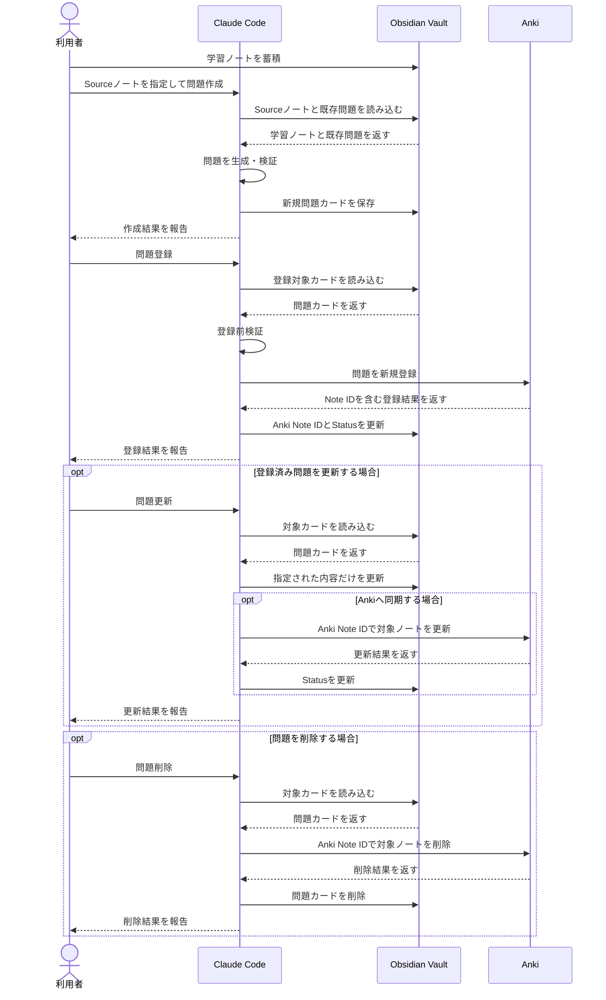

# Obsidian × Claude Code × AnkiMCP 暗記カード作成システム

## 目次

- [1. 概要](#1-概要)
- [2. 主な特徴](#2-主な特徴)
- [3. システム構成](#3-システム構成)
- [4. 処理の全体像](#4-処理の全体像)
- [5. タスク](#5-タスク)
- [6. ディレクトリ構成](#6-ディレクトリ構成)
- [7. 実行前提](#7-実行前提)
- [8. 基本的な使い方](#8-基本的な使い方)
- [9. 設計上の要点](#9-設計上の要点)
- [ドキュメント](#ドキュメント)
- [用語集](#用語集)

---

## 1. 概要

Obsidian Vault<sup><a href="#term-1">1</a></sup>に蓄積した学習ノートから、Claude Codeを用いて暗記カードを生成し、Anki<sup><a href="#term-2">2</a></sup>へ安全に登録・管理するためのプロジェクトである。

単なるカード生成の自動化ではなく、生成した問題をVault側のローカル原本<sup><a href="#term-3">3</a></sup>として保持し、Anki上の学習データとの対応関係と同期状態を管理することを重視する。問題の作成・登録・更新・削除は独立したタスクとして分離し、既存データの意図しない変更を防止する。

通常運用では、これらのタスクをClaude Codeへその場で対話指示して実行するのではなく、`.claude/scripts/` 配下にあらかじめ用意したPowerShellスクリプトから起動することを前提とする。後述の第8章「基本的な使い方」にある各PowerShell実行例も、この前提に基づいている。

---

## 2. 主な特徴

- `notes/` 配下のMarkdownノートを情報源として暗記カードを生成する
- 生成した問題は `cards/` 配下に1問1Markdownファイルで保存する
- Ankiでは標準ノートタイプ<sup><a href="#term-4">4</a></sup>の `Basic`<sup><a href="#term-5">5</a></sup> と `Cloze`<sup><a href="#term-6">6</a></sup> のみを使用する
- 問題作成・登録・更新・削除を独立したSkill<sup><a href="#term-7">7</a></sup>として管理する
- Sourceノート<sup><a href="#term-8">8</a></sup>の保存場所に応じてPath-specific rules<sup><a href="#term-9">9</a></sup>を適用し、ノートの種類ごとに出題方針を切り替える
- Ankiとの連携にはAnkiMCP<sup><a href="#term-10">10</a></sup>を使用し、登録・同期・削除の対象を明示的に制御する
- 各タスクは `claude -p`<sup><a href="#term-11">11</a></sup> による非対話実行を前提とし、利用可能なTool<sup><a href="#term-12">12</a></sup>をタスクごとに制限する


---

## 3. システム構成

本システムでは、Obsidian Vaultを問題作成・管理の基準とし、Ankiを復習と学習スケジューリングの実行環境として扱う。

- **Obsidian Vault**: 学習ノートと生成済み問題カードを保持する
- **Claude Code**: 問題の生成・検証・登録・更新・削除を実行する
- **Anki**: 登録済み問題を保持し、反復学習を行う
- **AnkiMCP**: Claude CodeとAnkiの間で登録・参照・更新・削除要求を仲介する

問題カードには、問題本文や解答に加えてローカルID<sup><a href="#term-13">13</a></sup>・Anki Note ID<sup><a href="#term-14">14</a></sup>・登録状態<sup><a href="#term-15">15</a></sup>・Sourceノート等の管理情報を保持する。これらの管理情報はAnkiの独自フィールドとして追加せず、Vault側だけで管理する。


---

## 4. 処理の全体像

通常運用では、学習ノートから問題を作成した後、内容を確認してからAnkiへ登録する。登録済み問題の更新・削除は、必要な場合だけ独立したタスクとして実行する。




---

## 5. タスク

本システムでは、次の4種類のタスクを定義する。

- **問題作成 `/create-cards`**: 指定したSourceノートから新しい問題カードを作成する
- **問題登録 `/register-cards`**: 未登録の問題カードを検証し、内容を変更せずAnkiへ新規登録する
- **問題更新 `/update-cards`**: 明示指定した既存問題だけを更新し、必要に応じてAnkiへ同期する
- **問題削除 `/delete-cards`**: 明示指定した問題について、Anki側とVault側のデータを安全な順序で削除する

各Skillは利用者または実行スクリプトから明示された場合だけ実行する。タスクの責務を越えた追加・更新・削除は行わない。


---

## 6. ディレクトリ構成

主要なディレクトリとファイルは次のとおりである。

```text
obsidian-repository/
├── .mcp.json
├── .claude/
│   ├── CLAUDE.md
│   ├── settings.json
│   ├── rules/
│   ├── skills/
│   │   ├── create-cards/
│   │   ├── register-cards/
│   │   ├── update-cards/
│   │   └── delete-cards/
│   ├── scripts/
│   │   ├── create-cards.ps1
│   │   ├── register-cards.ps1
│   │   ├── update-cards.ps1
│   │   └── delete-cards.ps1
│   └── doc/
│       ├── flashcard_workflow_spec.md
│       ├── card_format_reference.md
│       ├── ankimcp_reference.md
│       └── headless_command_reference.md
├── notes/
└── cards/
```

`notes/` は学習ノート、`cards/` は生成した問題カードのローカル原本を保存する。`.claude/` 配下にはClaude Codeの共通指示、Path-specific rules、Skills、実行スクリプト、詳細ドキュメントを集約する。


---

## 7. 実行前提

Claude CodeをVaultルートを作業ディレクトリとして実行できることを前提とする。

問題作成およびAnki同期を伴わないローカル更新では、ObsidianデスクトップアプリやAnkiを起動しておく必要はない。Claude CodeがVault内のファイルを直接読み書きする。

Ankiへの登録・同期・削除を行う場合は、Ankiを起動し、Anki MCP Server Addon<sup><a href="#term-16">16</a></sup>からAnkiMCPへ接続できる状態にしておく。


---

## 8. 基本的な使い方

### 8.1 問題を作成する

Sourceノート・登録予定デッキ・保存先・生成件数の上限目安を指定する。

```powershell
.\.claude\scripts\create-cards.ps1 `
  -Source "notes\books\example.md" `
  -Deck "it" `
  -TagPath "cards\it\web_application\frontend" `
  -Count 20
```

生成された問題は `cards/` 配下に保存される。この段階ではAnkiへ登録されない。

### 8.2 Ankiへ登録する

作成済み問題を確認した後、登録対象とAnkiデッキを指定する。

```powershell
.\.claude\scripts\register-cards.ps1 `
  -CardPath "cards\it\web_application\frontend" `
  -Deck "it"
```

登録成功後、対応する問題カードへAnki Note IDと登録状態が記録される。

### 8.3 既存問題を更新する

更新対象と変更内容を明示する。Ankiへ同期する場合だけ `-SyncAnki` を付与する。

```powershell
.\.claude\scripts\update-cards.ps1 `
  -CardPath "cards\it\web_application\frontend\<card-id>.md" `
  -Instruction "Backの補足を簡潔にする" `
  -SyncAnki
```

### 8.4 問題を削除する

削除対象はファイルパス・ローカルID・Anki Note IDのいずれかで一意に指定する。

```powershell
.\.claude\scripts\delete-cards.ps1 `
  -Id "it-20260905T200000-001"
```

Anki登録済みの問題は、Anki側の削除を確認した後にVault側の問題カードを削除する。


---

## 9. 設計上の要点

- 問題カードのローカル原本は `cards/` 配下のMarkdownファイルとする
- Ankiへの登録前にカード形式・登録状態・デッキ・ノートタイプ・フィールド構成を検証する
- Ankiでは標準の `Basic` と `Cloze` のみを使用し、ノートタイプ構成を自動変更しない
- 登録済み問題は `anki_note_id` によってAnkiノートと対応付ける
- 作成・登録・更新・削除の責務を分離し、明示されていない既存データへ変更を広げない
- Sourceノートの内容から裏付けられない知識を問題へ追加しない


---

## ドキュメント

詳細は目的に応じて次のドキュメントを参照する。

- [処理仕様書](.claude/doc/flashcard_workflow_spec.md): システム全体の設計・各タスクの詳細・実行条件・エラー処理
- [カード形式リファレンス](.claude/doc/card_format_reference.md): 問題カードのYAML Front Matter<sup><a href="#term-17">17</a></sup>・各項目・タグ・品質条件
- [AnkiMCPリファレンス](.claude/doc/ankimcp_reference.md): AnkiMCPのTool・入出力・Ankiとの対応
- [ヘッドレス実行リファレンス](.claude/doc/headless_command_reference.md): `claude -p` コマンド・CLIフラグ、タスク実行用PowerShellスクリプト
- [Claude Code共通指示](.claude/CLAUDE.md): プロジェクト全体で常に適用する原則
- [Skills](.claude/skills/): 問題作成・登録・更新・削除の具体的な実行手順
- [Rules](.claude/rules/): Sourceノートの種類ごとに適用する問題作成ルール

---

## 用語集

1. <a id="term-1"></a>**Vault**  
   Obsidianがノートや関連ファイルをまとめて管理する単位となるフォルダである。本プロジェクトではVaultルートをClaude Codeのプロジェクトルート兼作業ディレクトリとして扱い、`notes/`、`cards/`、`.claude/` 等を同一Vault内で管理する。

2. <a id="term-2"></a>**Anki**  
   フラッシュカードを用いた反復学習アプリケーションである。Ankiでは、学習内容そのものを**ノート**として保持し、そのノートに属する**フィールド**へ問題文や解答等を保存する。ノートは**ノートタイプ**に従って構造化され、ノートタイプに定義されたテンプレートから、実際に復習画面へ出題される**カード**が生成される。

   本プロジェクトでは、Vault側の1つの問題カード原本を、原則としてAnki側の1つのノートとして登録する。そのため、本プロジェクトでいう「問題カード」とAnki内部の「カード」は厳密には同義ではない。Ankiへの登録後は、Ankiがノートから学習用カードを生成し、デッキとスケジューリング機能によって復習を管理する。

    また、本プロジェクトではAnki側の構成を単純かつ安定的に保つため、ローカルでは論理名 `Basic` と `Cloze` だけを保持し、Ankiでは表示言語に応じた対応する標準ノートタイプだけを使用する。独自ノートタイプや独自フィールドは作成せず、問題本文・解答・タグのみをAnkiへ登録する。ローカルID、Source、登録状態等の運用管理情報はVault側に保持する。

   - **ノート（Note）**: Ankiに登録される情報の基本単位である。複数のフィールドとタグを持ち、ノートタイプに基づいて1枚以上のカードを生成する。本プロジェクトでは、1つのローカル問題カードを1つのAnkiノートとして登録する。
   - **カード（Card）**: Ankiがノートから生成し、実際の復習時に提示する出題単位である。ノートとは別の概念であり、1つのノートから複数のカードが生成される場合がある。
    - **ノートタイプ（Note Type）**: ノートが持つフィールドと、そこからどのようなカードを生成するかを定義する構造である。例えば標準ノートタイプの `Basic` は `Front` と `Back`、日本語環境では `表面` と `裏面` を使う単純な表裏カード、`Basic (and reversed card)` は1つのノートから正方向と逆方向の2枚を生成するカード、`Cloze` は文中の一部を穴埋めにするカードを表す。Ankiではこのほか独自ノートタイプを追加することもできるが、本プロジェクトでは構成を固定するため、ローカルでは論理名 `Basic` と `Cloze` だけを使用し、Ankiでは対応する標準ノートタイプだけを使用し、ノートタイプの構造を自動変更しない。
   - **フィールド（Field）**: Ankiノート内で情報を保存する項目である。Basic系では `Front` / `Back` または `表面` / `裏面`、Cloze系では `Text` / `Back Extra` または `テキスト` / `裏面補足` を使用する。
   - **デッキ（Deck）**: Ankiでカードを学習・整理する単位である。本プロジェクトでは問題登録時に既存デッキを明示的に指定し、存在しないデッキを自動作成しない。
   - **タグ（Tag）**: Ankiノートへ付与できる分類情報である。本プロジェクトでは分野・難易度・優先度をAnkiネイティブタグとして登録する。
   - **スケジューリング**: 各カードをいつ復習するかをAnkiが管理する仕組みである。本プロジェクトは問題の生成とAnkiへの登録・同期を担い、復習間隔や学習履歴の管理はAnki側に委ねる。

3. <a id="term-3"></a>**ローカル原本**  
   本プロジェクトにおいて、問題カードの管理上の基準となる `cards/` 配下のMarkdownファイルを指す。Anki上のノートを原本とはせず、問題内容と管理情報はローカル原本を基準として扱う。

4. <a id="term-4"></a>**標準ノートタイプ**  
    Ankiに標準で用意されているノートタイプを指す。表示言語により名称や標準フィールド名がローカライズされる。本プロジェクトでは、ローカルでは論理名 `Basic` と `Cloze` だけを使用し、Ankiではそれに対応する標準ノートタイプだけを使用する。独自ノートタイプの作成、独自フィールドの追加、テンプレートやスタイルの自動変更を行わない。これにより、Anki側の構成を固定し、Claude Codeからの登録・更新処理を予測可能に保つ。

5. <a id="term-5"></a>**Basic**  
    ローカルで使用する論理 `note_type` 名の一つであり、Anki標準の `Basic` または日本語環境の `基本` に対応する。主に一問一答形式に使用し、ローカルの `front` をAnkiの `Front` または `表面`、`back` を `Back` または `裏面` へ対応させる。明確な定義、用語、原理等を直接問う問題に使用する。

6. <a id="term-6"></a>**Cloze**  
    ローカルで使用する論理 `note_type` 名の一つであり、Anki標準の `Cloze` または日本語環境の `穴埋め問題` に対応する。本プロジェクトではローカルの `text` をAnkiの `Text` または `テキスト`、`back_extra` を `Back Extra` または `裏面補足` へ対応させる。前後の文脈を保持したまま一部を想起させたい知識に使用する。

7. <a id="term-7"></a>**Skill**  
   Claude Codeで特定タスクの実行手順や制約を再利用可能な形で定義する仕組みである。本プロジェクトでは `.claude/skills/` 配下に問題作成・登録・更新・削除のSkillを配置する。

8. <a id="term-8"></a>**Sourceノート**  
   問題カードを生成する情報源として指定された `notes/` 配下の学習ノートを指す。問題カードには、生成根拠を追跡できるようSourceノートのVault相対パスを保持する。

9. <a id="term-9"></a>**Path-specific rules**  
   読み込んだファイルのパスに応じて適用するClaude Codeのルールである。本プロジェクトでは、書籍ノート等の種類ごとに異なる問題作成方針を適用するために使用する。

10. <a id="term-10"></a>**AnkiMCP**  
    MCP（Model Context Protocol）を介してClaude CodeとAnkiを連携するための接続層である。本プロジェクトでは、デッキ・ノートタイプ・ノートの参照、新規登録、更新、削除等の操作を仲介する。AnkiMCP自体は学習データの管理主体ではない。

11. <a id="term-11"></a>**`claude -p`**  
    Claude Codeをプロンプト指定の非対話モードで実行するためのCLI形式である。本プロジェクトでは `.claude/scripts/` 配下の実行スクリプトから各Skillを実行するために使用する。

12. <a id="term-12"></a>**Tool**  
    Claude Codeが処理中に呼び出せる機能を指す。ファイルを読むRead、編集するEdit、AnkiMCP経由の操作等が該当する。本プロジェクトでは、タスクの責務を越えた操作を防ぐために利用可能なToolをタスクごとに制限する。

13. <a id="term-13"></a>**ローカルID**  
    Vault内で各問題カードを一意に識別するための本プロジェクト独自のIDである。問題カードの `id` とファイル名に使用し、Ankiのフィールドとしては登録しない。

14. <a id="term-14"></a>**Anki Note ID**  
    Ankiが各ノートへ付与する一意の識別子である。問題登録に成功した際、AnkiMCPから返されたNote IDをローカル原本の `anki_note_id` に保存する。登録後の更新・削除では、問題文やタグから対象を推測せず、このIDを使用してAnkiノートを特定する。

15. <a id="term-15"></a>**登録状態（`status`）**  
    ローカル原本とAnkiとの登録・同期状態を表す管理項目である。`draft` はAnki未登録、`registered` はAnki登録済みかつ同期済み、`needs_sync` はローカル原本の変更をAnkiへ同期する必要がある状態を表す。

16. <a id="term-16"></a>**Anki MCP Server Addon**  
    Anki内でMCPサーバーを動作させ、Claude CodeからAnkiMCP経由でAnkiを操作できるようにするアドオンである。Ankiへの登録・同期・削除を行う際は、Ankiとともにこのアドオンが動作している必要がある。

17. <a id="term-17"></a>**YAML Front Matter**  
    Markdownファイルの先頭に `---` で囲んで記述する構造化メタデータ領域である。例えば、問題カードのYAML Front Matterでは、`id`（ローカルID）, `anki_note_id`（Anki Note ID）, `status`（登録状態）, `note_type`（ノートタイプ）, `front / text`（問題文）, `back / back_extra`（解答・補足）, `tags`（タグ）, `source`（Sourceノートのパス）を保持する。
